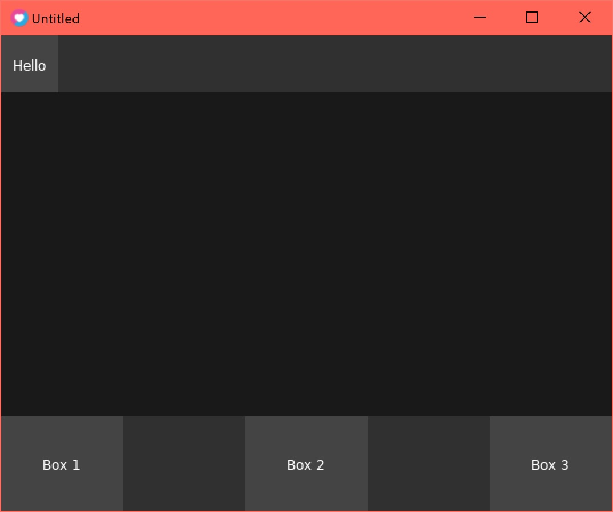

# love-uibox
A small UI skeleton for LOVE  

While making a game I, for some reason, started writing a UI framework instead of using a library...  

The uibox.lua is the bread and butter and is extendable (through 30og in this case)  
See uitext.lua for an example.  
The uibox is fully reactive as well, with everything defined relative to parent containers via size and offset.
Additionally you can define limits to the size in pixels.

```lua
require "30log.30log-global"
require "uibox"
require "uitext"

local editorMenu

function love.load()
  editorMenu = UIBox():setChildren("column",
    UIBox({size=1/5, min=50, max=50}):setChildren("row",
      UIBox({size=1/5, min=50, max=50}):setChildren("row",
        UIText({text="Hello", color={1,1,1,1}})
      )
    ),
    UIBox({size=1/5, offset=4/5, max=100, min=50}):setChildren("row",
      UIBox({size=1/5}):setChildren("row",
        UIText({text="Box 1", color={1,1,1,1}})
      ),
      UIBox({size=1/5, offset=2/5}):setChildren("row",
        UIText({text="Box 2", color={1,1,1,1}})
      ),
      UIBox({size=1/5, offset=4/5}):setChildren("row",
        UIText({text="Box 3", color={1,1,1,1}})
      )
    )
  )
  editorMenu:refresh()
end

function love.draw()
  editorMenu:drawUI()
end

function love.resize()
  editorMenu:refresh()
end
```



